# 🏠 Smart Home Automation UI (Flutter)

A modern and responsive **Smart Home Automation** mobile application built with **Flutter**. This project demonstrates a clean UI, smooth user experience, and interactive smart device controls for a home automation system.

> **Note:** This is a frontend demonstration project created for UI/UX and Flutter development purposes. It does **not** connect to real IoT devices, cloud services, or backend APIs.

---

## ✨ Features

### 🔐 Authentication
- Login Screen
- Registration Screen
- Form Validation
- Password Visibility Toggle

### 🏠 Room Management
- View Multiple Rooms
- Add New Room
- Edit Room Name
- Delete Room
- Switch Between Rooms

### 💡 Smart Device Control
- Smart Light Control
- Smart Speaker Control
- Thermostat Control
- Device Status Indicators
- Interactive Sliders
- Toggle Switches

### 🎨 User Interface
- Modern Material Design
- Dark Theme
- Light Theme
- Responsive Layout
- Smooth Animations
- Clean Card-Based Dashboard

### 👤 User Profile
- Profile Overview
- Room Statistics
- Device Statistics
- Logout

---

# 📱 Screens

- Login
- Register
- Home Dashboard
- Room Management
- Smart Light Control
- Smart Speaker Control
- Thermostat Control
- Profile
- Dark Theme
- Light Theme

---

# 🛠 Built With

- Flutter
- Dart
- Material Design 3

---

# 📂 Project Structure

```
lib/
├── models/
├── screens/
│   ├── auth/
│   ├── home/
│   ├── profile/
│   └── devices/
├── widgets/
├── services/
├── theme/
├── utils/
└── main.dart
```

*(Project structure may vary depending on your implementation.)*

---

# 🚀 Getting Started

## Prerequisites

- Flutter SDK (3.x or later)
- Dart SDK
- Android Studio or VS Code
- Android Emulator or Physical Device

---

## Installation

Clone the repository

```bash
git clone https://github.com/YOUR_USERNAME/flutter-smart-home-ui.git
```

Go to the project folder

```bash
cd flutter-smart-home-ui
```

Install dependencies

```bash
flutter pub get
```

Run the application

```bash
flutter run
```

---

# 📸 Screenshots

## Login

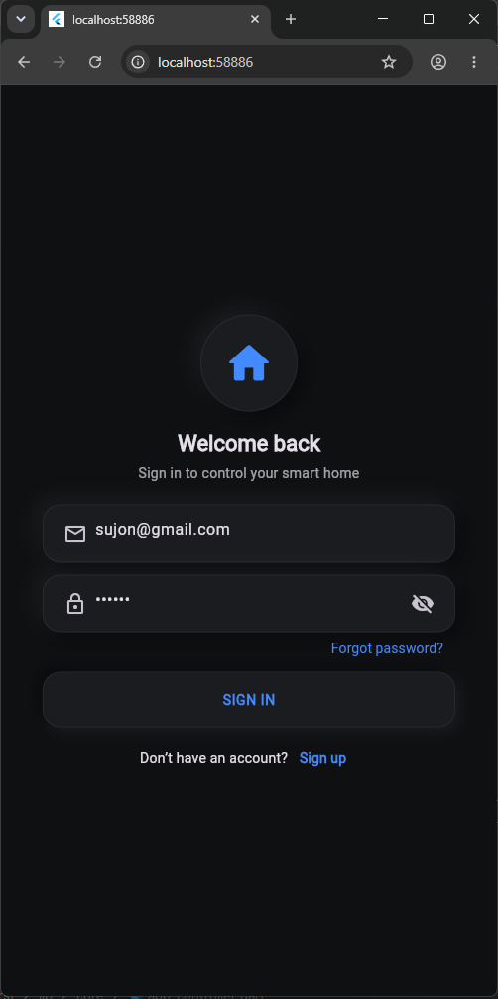

## Register

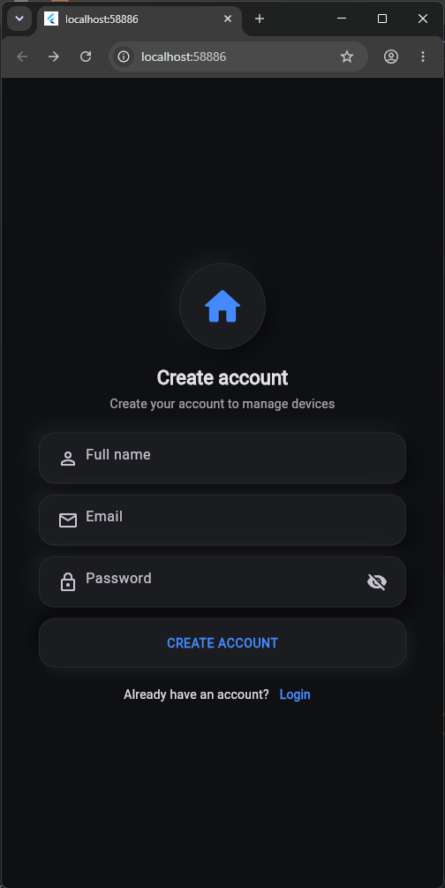

## Dashboard

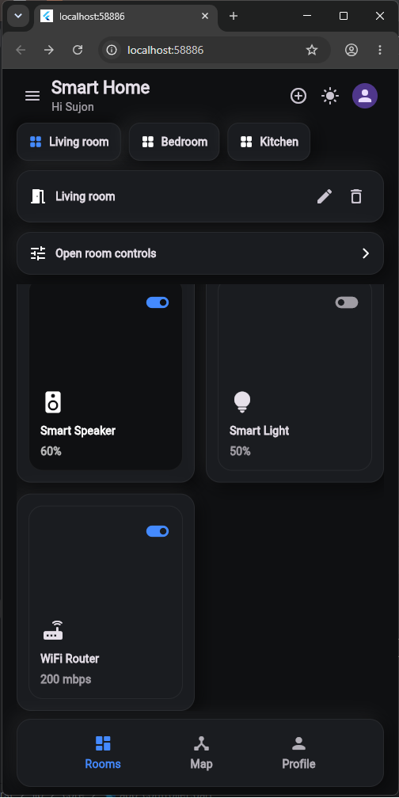

## Create-new-room

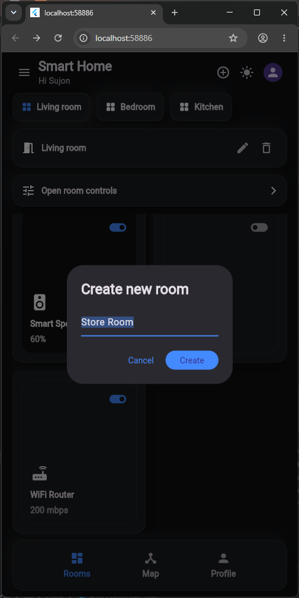

## Delete-room

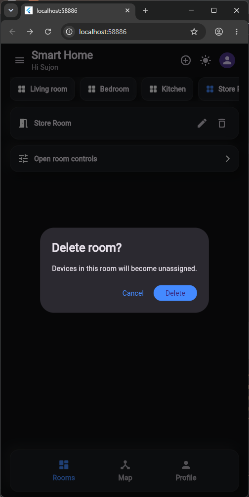

## Room

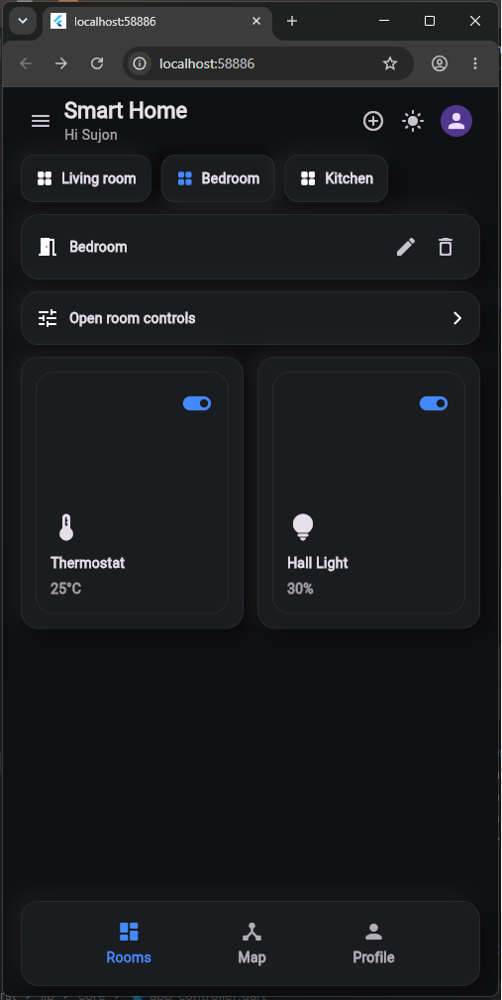

## Smart Light

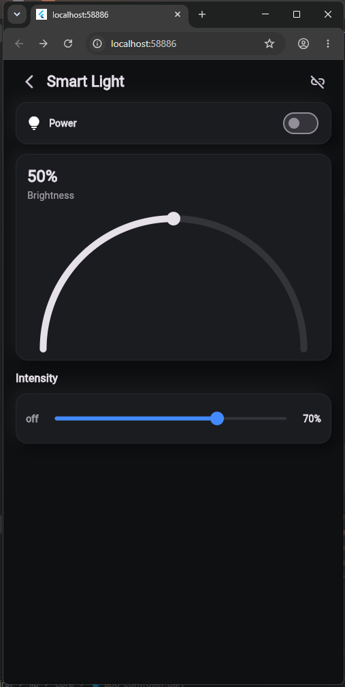

## Smart Speaker

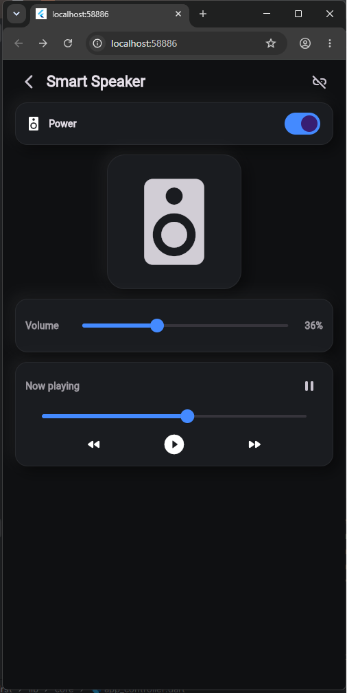

## Thermostat

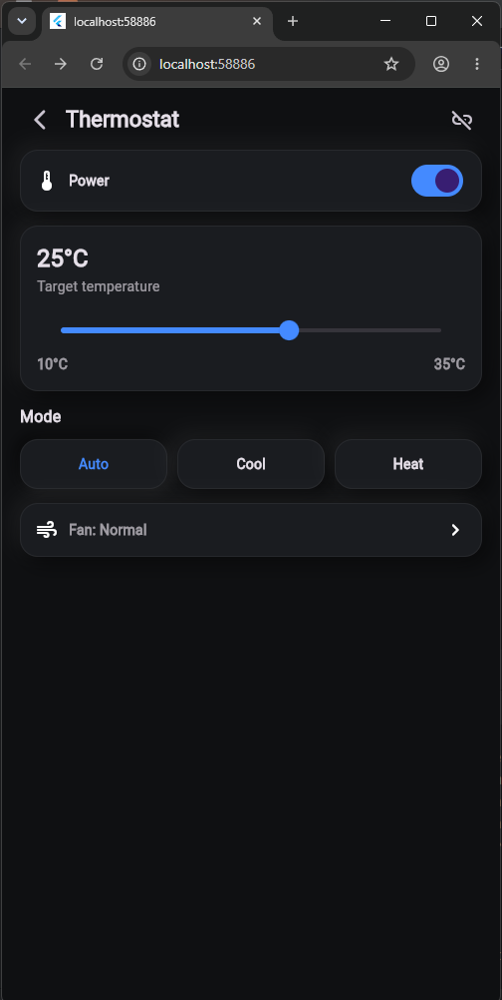

## Profile

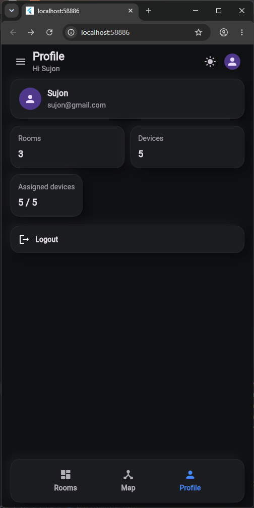
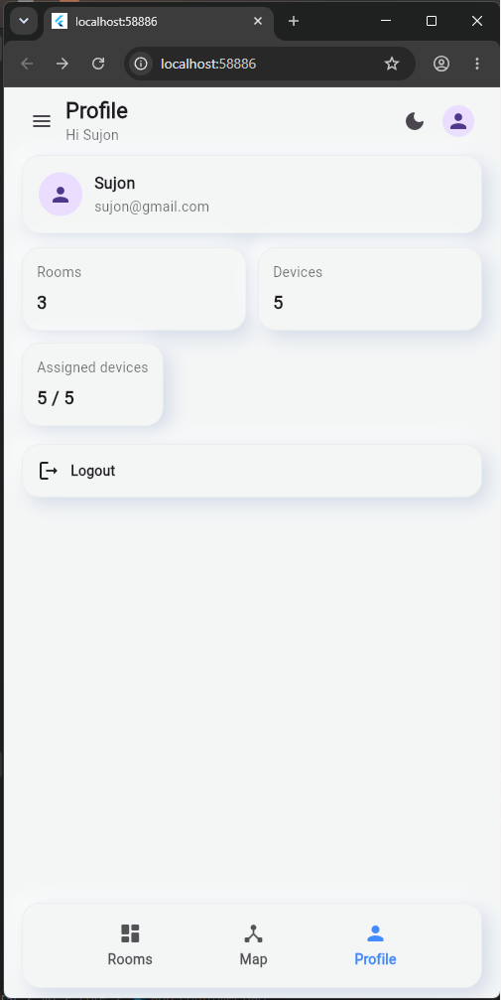

---

# 🎯 Future Improvements

- Firebase Authentication
- MQTT Integration
- ESP32 Connectivity
- Home Assistant Integration
- Device Scheduling
- Voice Assistant Support
- Push Notifications
- Energy Consumption Analytics
- Charts & Statistics
- Device Automation Rules

---

# 💼 Purpose

This project was developed to demonstrate Flutter UI development skills, responsive mobile design, state management, and frontend architecture for a smart home application.

---

# 🤝 Contributing

Contributions, suggestions, and improvements are welcome.

1. Fork the repository
2. Create a new branch

```
git checkout -b feature-name
```

3. Commit your changes

```
git commit -m "Add new feature"
```

4. Push the branch

```
git push origin feature-name
```

5. Open a Pull Request

---

# 📄 License

This project is licensed under the MIT License.

---

# 👨‍💻 Developer

**Sujon Siddiquee**

- 🎓 B.Sc. in IoT & Robotics Engineering
- 💙 Flutter Developer
- 🤖 IoT & Embedded Systems Enthusiast

---

⭐ If you like this project, consider giving it a **Star** on GitHub!